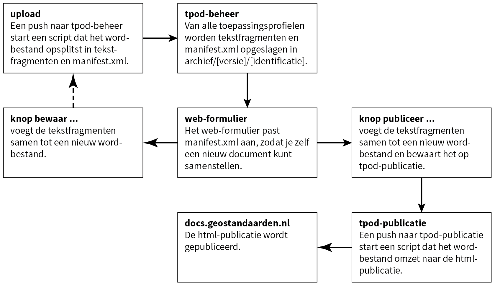

# Beheer van toepassingsprofielen

Voor het beheer en publicatie van de toepassingsprofielen zijn drie repositories ingericht:

- tpod-beheer voor de opslag van alle toepassingsprofielen
- tpod-publicatie voor de publicatie van een toepassingsprofiel

Daarnaast is er een web-formulier voor het handmatig aanpassen van een manifest.xml.

## Opbouw van de repositories

Schematisch is de route voor het beheer als volgt:



## tpod-beheer

Deze repository bevat het centrale archief voor de opslag van alle toepassingsprofielen. De indeling is als volgt:


Door een toepassingsprofiel te pushen naar repository tpod-beheer start een transformatie dat het word-document opsplitst in tekstfragmenten. Elk tekstfragment wordt als word-document opgeslagen. De indeling van het oorspronkelijke word-document wordt vastgelegd in bestand manifest.xml.

```
<?xml version="1.0" encoding="UTF-8" standalone="yes"?>
<manifest>
  <naam>TPOD Omgevingsverordening_werkversie.docx</naam>
  <datum>2021-06-04T08:45:42.78+02:00</datum>
  <colofon index="0">
    <naam>000_Colofon.docx</naam>
    <omgevingswetbesluit id="ov">omgevingsverordening</omgevingswetbesluit>
    <afbeelding index="1">
      <naam>image_e698d2f4d0e67fbbb74cf02ac2d7a011.png</naam>
      <omgevingswetbesluit id="bt">basistekst</omgevingswetbesluit>
      <type>png</type>
      <checksum>e698d2f4d0e67fbbb74cf02ac2d7a011</checksum>
    </afbeelding>
    <metadata>
      ...
    </metadata>
    <versiehistorie>
      ...
    </versiehistorie>
  </colofon>
  <document index="1">
    <naam>001_Uitgangspunten_voor_de_modellering.docx</naam>
    <omgevingswetbesluit id="bt">basistekst</omgevingswetbesluit>
    <versie>2.0.0-rc</versie>
    <titel>Uitgangspunten voor de modellering</titel>
    <niveau>1</niveau>
    <checksum>70b07588f5bcccc211add9f1c3903d72</checksum>
  </document>
    ...
  <document index="8">
    <naam>008_Inhoudelijke_aspecten_van_DOCVARIABLE_ID01.docx</naam>
    <omgevingswetbesluit id="ov">omgevingsverordening</omgevingswetbesluit>
    <versie>2.0.0-rc</versie>
    <titel>Inhoudelijke aspecten van de omgevingsverordening</titel>
    <niveau>2</niveau>
    <checksum>6a8401dc4f8da8deeff859a796c6846a</checksum>
  </document>
    ...
</manifest>
```

Bij de documenten staat aangegeven uit welke versie deze afkomstig is. Dit wordt bepaald op basis van de checksum van de tekst in het fragment. Komt de checksum tussen toepassingsprofiel en basistekst overeen, dan wordt het tekstfragment uit de basistekst opgenomen in manifest.xml.

## web-formulier

Het web-formulier heeft twee doelen:

- Je kunt selecteren welk toepassingsprofiel je lokaal wilt bewaren of publiceren.
- Je kunt van het toepassingsprofiel de indeling veranderen door manifest.xml aan te passen.

Het web-formulier bevat twee knoppen, ‘bewaar’ en ‘publiceer’. Beide voeren een transformatie uit dat op basis van manifest.xml een nieuw word-document samenstelt. Knop ‘bewaar’ slaat het word-bestand lokaal op, knop ‘publiceer’ in repository tpod-publicatie, waardoor een script start.

## tpod-publicatie

De normale word2publicatie-transformatie maakt twee versies van het word-bestand:

- respec-versie bevat de publicatie in respec-html, een standaard van W3C,
- snapshot-versie bevat de publicatie in reguliere html.

Bij de toepassingsprofielen hebben we het probleem dat de gebruikte koppenstructuur niet wordt ondersteund door respec. Hiervoor is de rhino-transformatie (respec-html in name only) ontwikkeld, dat rechtstreeks transformeert naar de snapshot-versie, wel met de respec-functionaliteit maar zonder de respec-beperkingen. Een push naar repository tpod-publicatie start de rhino-transformatie.